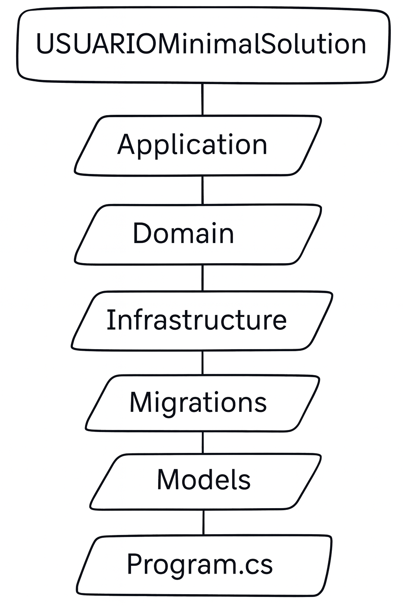

<p align="center">
  
</p>

<h1 align="center">USUARIOMinimalSolution</h1>

<p align="center">Simplicidade, performance e arquitetura limpa — do jeito que uma API deve ser.</p>

<p align="center">
  
  
  
  
  
  
  
</p>


---

## 📌 Visão Geral

Este projeto implementa uma API REST completa para gerenciamento de usuários, usando:

.NET 9 (Web API Minimal / Controllers)
Oracle + EF Core
Repository Pattern
Camadas separadas seguindo Clean Architecture
Paginação, filtros, ordenação e HATEOAS
Middleware global de tratamento de erros
Swagger/OpenAPI
Observabilidade com logs, métricas e tracing
Testes automatizados (Unit + Integration)

A API atende exatamente os requisitos solicitados na disciplina:

🔹 CRUD
🔹 Search com paginação
🔹 HATEOAS
🔹 Migrations
🔹 Arquitetura organizada
🔹 Monitoramento e Observabilidade
🔹 Testes Automatizados (AAA)
🔹 README 
---

# 🏛️ Arquitetura do Projeto

<p align="center">
  
</p>

<p align="center">
  
</p>

<p align="center">
  
</p>

---

## 🧱 Estrutura da Solução


-🔹ProjetoFinal/
- |
-|🔹-USUARIOminalSolution/
- |   │── Application/ → DTOs, Services, Validations
- |   │── Domain/ → Entidades, regras de negócio
- |   │── Infrastructure/ → DbContext, Repositórios, Oracle, Migrations Models/ → Models auxiliares
- |   │── Web/ → Controllers, Configurações, Middleware
- |   │── Program.cs → Setup da aplicação
- |   │── IMAGES/ → Logos e diagramas do projeto
- |   │── Models/ → Models auxiliares
- |   │── Web/ → Controllers, Configurações, Middleware
- |   │── Program.cs → Setup da aplicação
-|
-│🔹-Tests/
-    |-USUARIOminimalASolution.IntegrationTests
-    |-USUARIOminimalSolution.UnitTests

---

# 🧩 Decisões Arquiteturais

### ✔ Clean Architecture + Separation of Concerns
Camadas isoladas e independentes.

### ✔ Repository Pattern
Evita acesso direto ao DbContext no controller.

### ✔ DTOs
Não expõe entidades para o mundo externo.

### ✔ HATEOAS
Cada item retornado no search contém:

"links": {
"get": "/api/Usuario/1",
"put": "/api/Usuario/1",
"delete": "/api/Usuario/1"
}


### ✔ Exception Middleware
Captura erros e responde com JSON padronizado.

### ✔ Migrations
Configuração EF Core + Oracle funcionando corretamente.

### ✔ Monitoramento e Observabilidade
❤️ Health Checks

Endpoint disponível:

GET /health
🔍 O que este endpoint verifica:
- ✔ Se a API está em execução
- ✔ Conectividade com o banco Oracle
- ✔ Se os serviços essenciais estão respondendo
### Exemplo de resposta:
{
"status": "Healthy",
"checks": [
{
"name": "database",
"status": "Healthy"
}
]
}
▶️ Como testar:

Você pode acessar de 3 formas:

- 🔹 Browser:
http://localhost:5229/health
- 🔹 Postman
-  🔹 cURL:
curl http://localhost:5229/health

👉 Se tudo estiver correto, o retorno será Healthy
👉 Caso haja falha (ex: banco fora), o status será Unhealthy

### ✔ Logging Estruturado

Implementado com Serilog:

- ✔ Logs em arquivo e console
- ✔ Níveis: Information, Warning, Error
- ✔ Rastreamento de erros da aplicação 

### ✔Tracing e Métricas

Implementado com OpenTelemetry:

- ✔ Rastreamento de requisições (Tracing)
- ✔ Tempo de resposta da API
- ✔ Monitoramento de performance

### ✔ Testes Automatizados
✔ Testes Unitários
- Framework: xUnit
- Mock: Moq
Padrão: AAA (Arrange, Act, Assert)

✔ Testes de Integração
- Utilizando WebApplicationFactory
Testes reais de endpoints HTTP
- Validação de respostas e erros
▶️ Como executar os testes
dotnet test

# ⚙️ Como Rodar o Projeto

## 1️⃣ Configurar o Oracle

Crie no Oracle:

```sql
CREATE TABLE USUARIO (
  ID_USUARIO NUMBER GENERATED BY DEFAULT AS IDENTITY PRIMARY KEY,
  NOME VARCHAR2(100),
  EMAIL VARCHAR2(150),
  SENHA VARCHAR2(200),
  CREATEDAT DATE
);
```
2️⃣ Configurar o connection.txt

Edite:

User Id=SYSTEM;Password=SUASENHA;Data Source=localhost:1521/XEPDB1;

3️⃣ Aplicar Migrations
dotnet ef database update

▶️ Como Rodar a API
dotnet run


Swagger abrirá em:

👉 http://localhost:5229/swagger

🔍 Endpoints da API
📌 Criar Usuário
POST /api/Usuario

📌 Buscar por ID
GET /api/Usuario/{id}

📌 Atualizar
PUT /api/Usuario/{id}

📌 Deletar
DELETE /api/Usuario/{id}

📌 Search com filtros/paginação
GET /api/Usuario/search?nome=ana&page=1&pageSize=10&sortBy=nome&asc=true

📤 Exemplos de Uso da API

A seguir estão exemplos reais para testar a API usando cURL, totalmente atualizados e mais bonitos.

🚀 Criar Usuário
curl -X POST "http://localhost:5229/api/Usuario" \
-H "Content-Type: application/json" \
-d '{
"nome": "Lucas Siqueira",
"email": "lucas@exemplo.com",
"senha": "123456"
}'

🔍 Buscar Usuários com Paginação + Filtros

```bash
curl "http://localhost:5229/api/Usuario/search?nome=lucas&page=1&pageSize=5&sortBy=nome&asc=true"

✏️ Atualizar Usuário
curl -X PUT "http://localhost:5229/api/Usuario/1" \
-H "Content-Type: application/json" \
-d '{
"nome": "Lucas Atualizado",
"email": "lucas.update@exemplo.com",
"senha": "novaSenha123"
}'

🗑️ Excluir Usuário
curl -X DELETE "http://localhost:5229/api/Usuario/1"

🧪 Exemplo de Resposta com HATEOAS
{
"id_Usuario": 1,
"nome": "Lucas Siqueira",
"email": "lucas@exemplo.com",
"links": {
"get": "/api/Usuario/1",
"put": "/api/Usuario/1",
"delete": "/api/Usuario/1"
}
}
```

👨‍💻 Autor

Lucas Siqueira — SENSE WORK
Projeto acadêmico desenvolvido com padrões profissionais, arquitetura limpa e boas práticas modernas.

<p align="center">  </p>